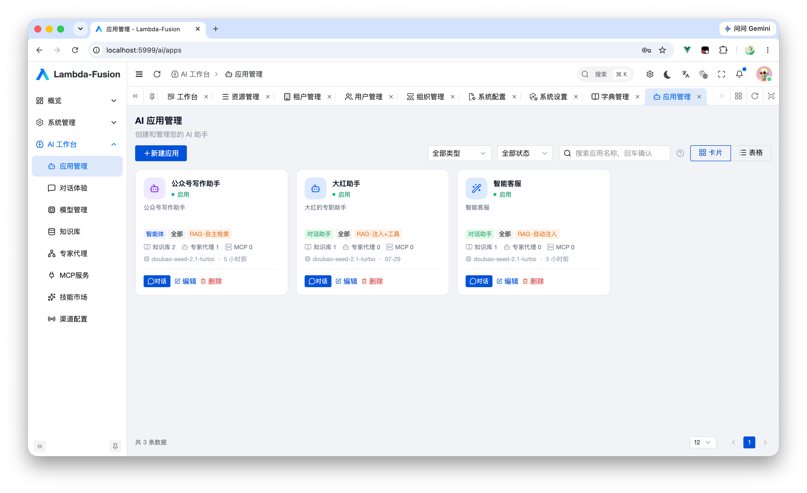
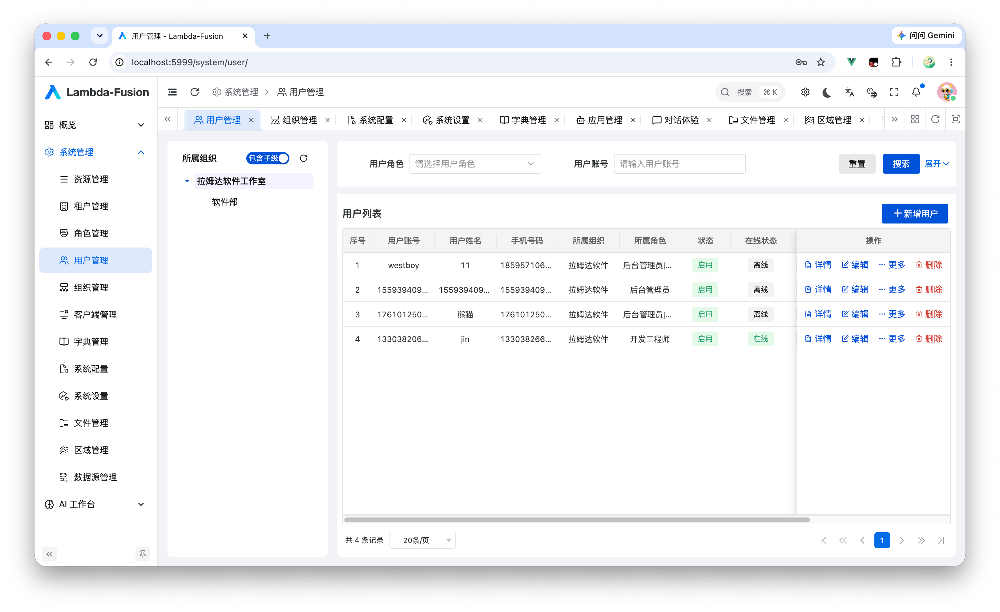
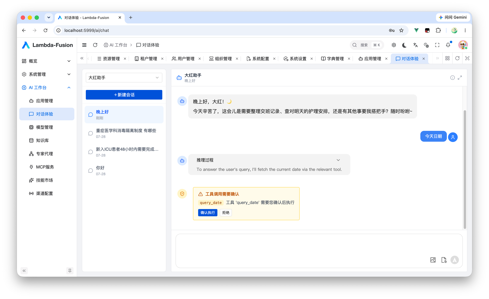
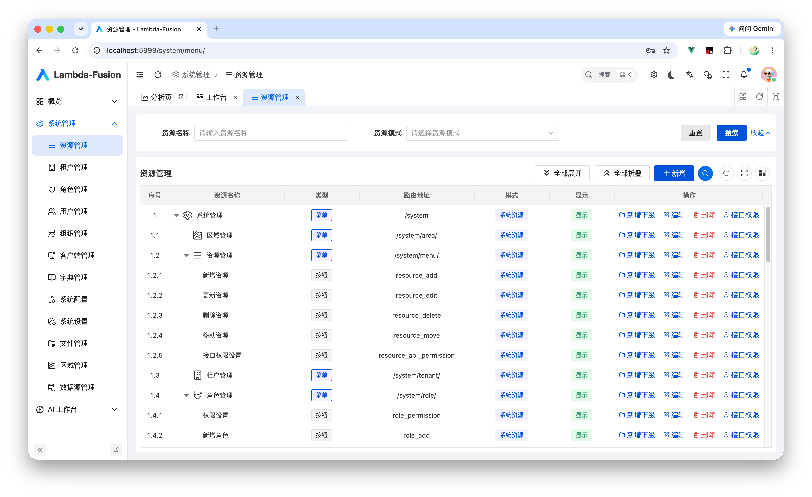
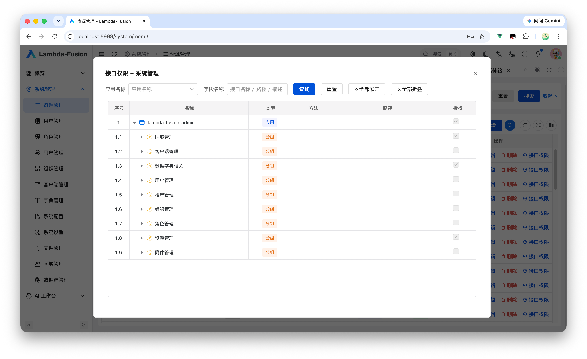
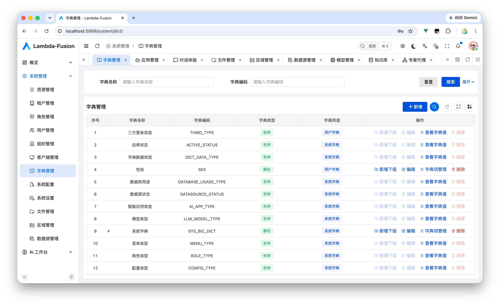
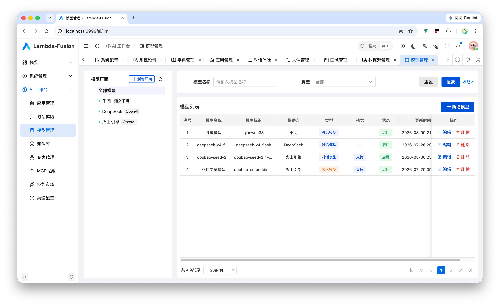
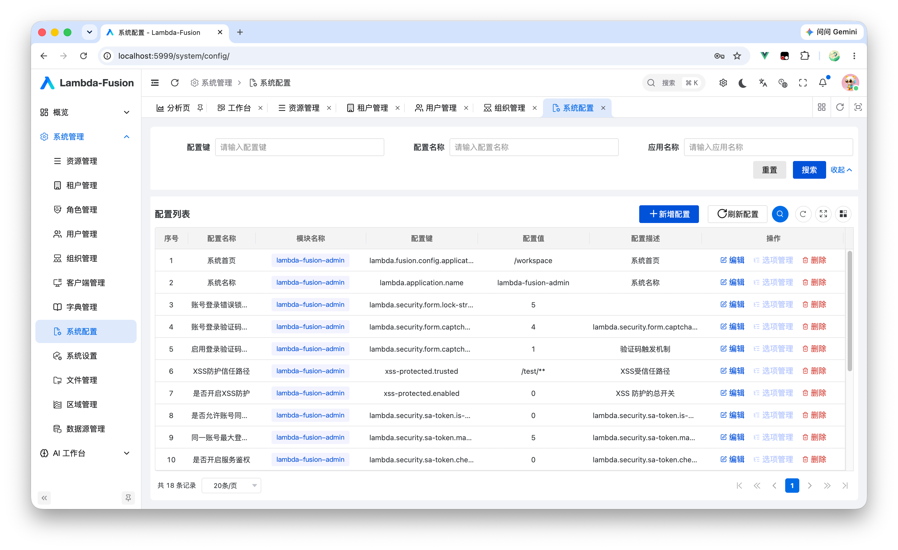

<div align="center">

<p align="center">
	
</p>

# 🚀 Lambda Fusion Framework

**企业级基础能力 × AI 智能平台，开箱即用的全栈微服务开发框架**

[](https://spring.io/projects/spring-boot)
[](https://spring.io/projects/spring-cloud)
[](https://www.oracle.com/java/technologies/javase-downloads.html)
[](https://github.com/agentscope-ai/agentscope)
[](https://www.apache.org/licenses/LICENSE-2.0)

</div>

---

## 📋 项目简介

Lambda Fusion 是一套 **「企业级基础能力 + AI 智能平台」** 的全栈微服务开发框架，基于 Spring Boot 4 / Spring Cloud 2025.1 / JDK 21 构建，AI 能力由 **AgentScope 2.0** 多智能体运行时驱动。

在 [lambda-cloud-parent](https://gitee.com/westboy/lambda-cloud-parent) 基座之上，框架将两条主线能力统一沉淀为开箱即用的 `lambda-fusion-*` starter：

- 🏢 **企业级基础能力**：权限、多租户、配置、字典、数据源、附件、日志
- 🤖 **大模型应用开发**：智能体、知识库 RAG、LLM 管理、子代理、技能市场、MCP、通道网关


## 🏢 企业级基础能力

业务系统的生产级底座，覆盖后台管理的高频刚需：

| 能力 | 说明                                                               |
|------|------------------------------------------------------------------|
| 🔐 **权限体系** | 基于 Sa-Token 的完整 RBAC：用户、角色、组织、资源（菜单/按钮/API）统一管理，客户端应用鉴权、SSO 单点登录 |
| 🏠 **多租户** | 轻量 tenant_id 字段级隔离，、天然复用 RBAC 能力                                 |
| 🛡️ **细粒度授权** | server / client 双端 API 权限元数据统一注册与校验，叠加数据权限授权树，实现接口级 + 数据行级双重鉴权   |
| ⚙️ **动态配置** | 数据库配置源统一托管，支持本地热更新与 Nacos 配置中心同步发布，配置变更免重启生效                     |
| 📚 **数据字典** | 静态枚举与动态字典双模式，枚举类扫描自动注册入库，字典翻译开箱即用                                |
| 🗄️ **动态数据源** | server / client 多数据源统一注册与管理，基于 Dubbo 的服务间数据源分发，多库接入对业务透明         |
| 📤 **附件管理** | 统一封装七牛云 / S3 兼容对象存储，文件上传、访问控制等能力开箱即用                             |

## 🤖 AI应用开发能力

 基于 **AgentScope 2.0** 构建，覆盖 **模型接入 → 知识增强 → Agent 编排 → 通道落地** 的完整链路：

### 🧠 智能应用

| 形态 | 说明 |
|------|------|
| 💬 **CHAT 型** | 轻量对话应用，SSE 流式输出，开箱即用 |
| 🕹️ **AGENTIC 型** | 具备工具调用与自主规划能力的智能体应用 |

### 🧰 核心能力

| 能力 | 说明 |
|------|------|
| ♻️ **自演化** | 应用在运行过程中持续自我优化演进 |
| 🖥️ **多沙箱后端** | 代码与工具执行环境隔离，支持多种沙箱实现按需切换 |
| 📚 **知识库 RAG** | 文档切块入库，基于 pgvector 的向量检索，提供 `GENERIC` / `AGENTIC` / `BOTH` 三种检索注入模式 |
| 🧠 **LLM 管理** | 大模型统一接入与集中管理，模型能力即插即用 |
| 🧩 **子代理（Sub-Agent）** | DB 驱动的子代理体系，定义持久化、运行可编排 |
| 🛠️ **技能市场** | 技能注册、沉淀与复用，Agent 能力可插拔扩展 |
| 🔌 **MCP 工具接入** | 原生支持 Model Context Protocol，接入开放的 MCP 工具生态 |
| 📨 **通道网关** | 钉钉 / 飞书 / 企业微信通道适配，智能体能力直达 IM 工作场景 |

## 🏗️ 项目架构

模块化设计，双引擎并列，各模块职责清晰、按需引入：

```
lambda-fusion-parent/
├── 🤖 lambda-fusion-ai/                   # AI 智能平台（基于 AgentScope 2.0）
├── 📦 lambda-fusion-bom/                  # BOM 依赖管理
├── 🎯 lambda-fusion-core/                 # 核心模块（分页/CRUD/树/字典/身份）
├── 🔐 lambda-fusion-authority-api/        # 权限 API（Dubbo 远程认证 + Sa-Token 适配）
├── 🔐 lambda-fusion-authority/            # 权限管理（用户、角色、组织、资源、租户、客户端）
├── 🛡️ lambda-fusion-permission/           # 权限控制（聚合模块）
│   ├── lambda-fusion-permission-api/          # API 权限元数据（client/server）
│   └── lambda-fusion-permission-datascope/    # 数据权限授权树
├── ⚙️ lambda-fusion-config/               # 配置管理（dbconfig + 热更新 + Nacos 发布）
├── 📚 lambda-fusion-dictionary/           # 数据字典（静态/动态字典、枚举扫描）
├── 🗄️ lambda-fusion-datasource/           # 动态数据源管理（server/client、Dubbo 分发）
├── 📤 lambda-fusion-oss/                  # 附件管理（七牛/S3）
└── 🚀 lambda-fusion-startup/              # 可运行演示应用（端口 20005）
```

## 🛠️ 技术栈

| 技术 | 版本 | 说明 |
|------|------|------|
| ☕ **Java** | 21+ | 最新 LTS 版本，性能优异 |
| 🍃 **Spring Boot** | 4.0.2 | 微服务开发框架 |
| ☁️ **Spring Cloud** | 2025.1.x | 微服务生态组件 |
| 🤖 **AgentScope** | 2.0 | AI 多智能体运行时（harness / 模型 / 沙箱 / 通道 / 技能 / RAG） |
| 🐘 **pgvector** | Latest | PostgreSQL 向量检索（知识库 RAG） |
| 🔐 **Sa-Token** | Latest | 轻量级权限认证框架 |
| 💾 **MyBatis Plus** | Latest | 增强版 ORM 框架 |
| 🔄 **MapStruct** | Latest | 高性能对象映射 |
| 🌶️ **Lombok** | Latest | 简化 Java 代码 |
| ☁️ **Nacos** | Latest | 配置中心 / 注册中心 |
| ☁️ **Dubbo** | Latest | 远程认证 / 数据源 / 权限元数据同步 |
| ☕ **Caffeine** | Latest | 高性能本地缓存 |
| 🔧 **Hutool** | Latest | Java 工具类库 |

## 🎨 预览与体验

<div align="center">
<table>
  <tr>
    <td align="center"></td>
    <td align="center"></td>
  </tr>
  <tr>
    <td align="center"></td>
    <td align="center"></td>
  </tr>
  <tr>
    <td align="center"></td>
    <td align="center"></td>
  </tr>
  <tr>
    <td align="center"></td>
    <td align="center"></td>
  </tr>
</table>
</div>

## 🚀 快速开始

### 环境要求

- JDK 21+
- Maven 3.8+
- MySQL 8.0+ / PostgreSQL 12+
- Redis 6.0+

### 引入依赖

在项目 `pom.xml` 中添加：

```xml
<dependencyManagement>
    <dependencies>
        <dependency>
            <groupId>com.lambda.cloud</groupId>
            <artifactId>lambda-fusion-bom</artifactId>
            <version>${lambda-fusion.version}</version>
            <type>pom</type>
            <scope>import</scope>
        </dependency>
    </dependencies>
</dependencyManagement>
```

### 使用模块

按需引入，自由组合：

```xml
<!-- AI 智能平台（基于 AgentScope 2.0） -->
<dependency>
    <groupId>com.lambda.cloud</groupId>
    <artifactId>lambda-fusion-ai</artifactId>
</dependency>

<!-- 权限管理 -->
<dependency>
    <groupId>com.lambda.cloud</groupId>
    <artifactId>lambda-fusion-authority</artifactId>
</dependency>

<!-- 配置管理 -->
<dependency>
    <groupId>com.lambda.cloud</groupId>
    <artifactId>lambda-fusion-config</artifactId>
</dependency>

<!-- 数据字典 -->
<dependency>
    <groupId>com.lambda.cloud</groupId>
    <artifactId>lambda-fusion-dictionary</artifactId>
</dependency>
```

> 基座 `lambda-cloud-parent`、`lambda-cloud-project-parent` 需先安装到本地仓库或私服，再构建本仓库。

### 构建与测试

本仓库没有 Maven wrapper，请使用系统 `mvn`（Maven 3.8+、JDK 21）。

```bash
# 构建 + 安装到本地仓库（在仓库根目录执行）
mvn clean install

# 仅构建单个模块及其 fusion 依赖（-am = 同时构建依赖）
mvn -pl lambda-fusion-authority -am clean install

# 仅编译（同时触发 Spotless 检查 + SpotBugs 检查，见「代码风格与静态检查」）
mvn -pl lambda-fusion-config compile

# 运行某模块的全部测试（目前仅 lambda-fusion-ai 有测试）
mvn -pl lambda-fusion-ai test

# 运行单个测试类 / 单个方法
mvn -pl lambda-fusion-ai test -Dtest=AgentGraphTest
mvn -pl lambda-fusion-ai test -Dtest=AgentGraphTest#shouldRoute
```

---

## 📖 生态依赖

- **[lambda-cloud-parent](https://gitee.com/westboy/lambda-cloud-parent)** — 核心基座，封装底层自动化配置与基础工具类
- **[lambda-cloud-project-parent](https://gitee.com/westboy/lambda-cloud-project-parent)** — 统管项目依赖版本与 Maven 构建标准
- **[lambda-fusion-web](https://gitee.com/westboy/lambda-fusion-web)** — 基于 Vben Admin 构建的现代化前端界面

## 📚 相关资源

- 🎯 [实战项目示例](https://gitee.com/westboy/lambda-fusion-admin)

## 📄 开源协议

本项目基于 [Apache License 2.0](https://www.apache.org/licenses/LICENSE-2.0) 开源协议。

**⭐ 如果这个项目对你有帮助，请给个 Star 支持一下！**❤️
